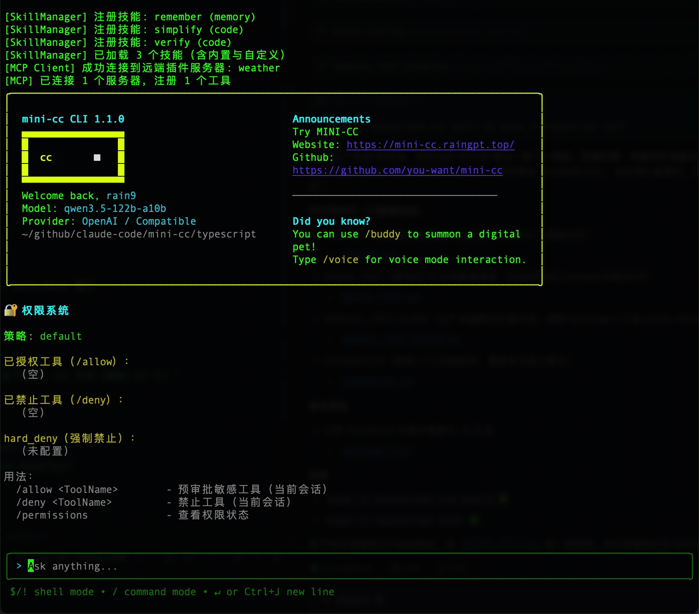
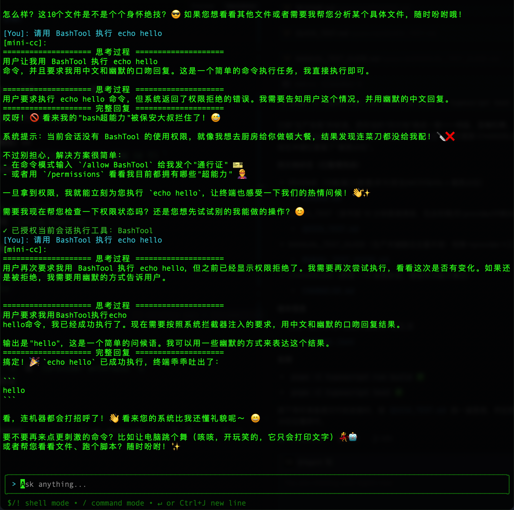
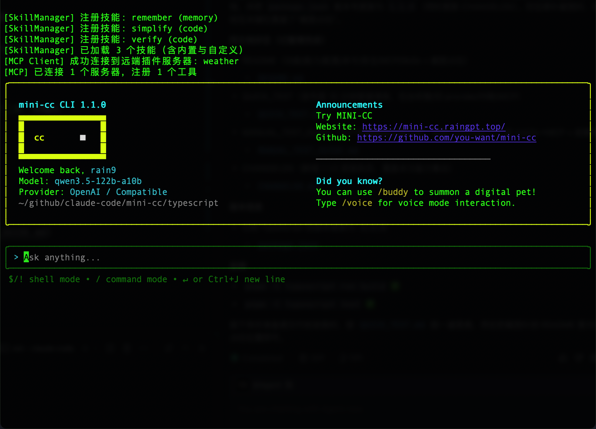

# 🧪 发布前快速冒烟测试（10 分钟）

本清单用于准备发布版本前的最小验证集合。

文档对应关系：
- 产品说明：README.md
- 快速冒烟：你正在阅读的 QUICK_TEST.md
- 完整手测：MANUAL_TEST_GUIDE.md
- 版本变更：CHANGELOG.md

## ⚡ 一键执行（推荐）

```bash
cd typescript
./run-manual-tests.sh
```

这个脚本会自动：
1. ✅ 检查编译状态
2. ✅ 创建测试文件（Notebook 和 TypeScript）
3. ✅ 运行自动化测试
4. ✅ 显示下一步操作指南

---

## ✅ 交互 UI 冒烟（必测）

启动：

```bash
cd typescript
pnpm install
pnpm run build
pnpm start
```

1) **权限系统是否生效**
- 输入：`/permissions`
- 预期：能看到策略、allow/deny 列表、hard_deny 提示



2) **安全工具是否可用（无需授权）**
- 输入：`请用 GlobTool 列出 src 目录下所有 .ts 文件（限制 10 个）`
- 预期：调用 GlobTool 并返回结果

3) **敏感工具是否默认拒绝**
- 输入：`请用 BashTool 执行 echo hello`
- 预期：被权限拒绝，并提示使用 `/allow BashTool`

4) **授权后是否可执行敏感工具**
- 输入：`/allow BashTool`
- 再输入：`请用 BashTool 执行 echo hello`
- 预期：成功执行并返回 `hello`



5) **Provider 热切换**
- 输入：`/provider`
- 输入：`/provider openai -s` 或 `/provider anthropic -s`
- 预期：显示切换成功，并清空会话

6) **中断是否生效**
- 在模型输出过程中按 `Esc`（或 `Ctrl+C`）
- 预期：停止输出，并出现“已中断当前请求”的系统提示

---

## 🧩 MCP 冒烟（可选，但建议）

前提：你有可用的 MCP server 配置（项目级或用户级）。

- 项目级配置文件：`<project>/.mini-cc/settings.json`
- 用户级配置文件：`~/.mini-cc/settings.json`

启动 mini-cc 后观察日志：
- 预期：出现类似 `[MCP] 已连接 ... 注册 ... 个工具` 的输出



---

## 📖 需要更细的手测？

查看 [MANUAL_TEST_GUIDE.md](./MANUAL_TEST_GUIDE.md)

## 📊 发布记录（建议在 PR 描述里粘贴）

```markdown
## Release Smoke Test (Quick)

日期: ___________
版本: ___________

- [ ] pnpm build / pnpm test 通过
- [ ] /permissions 可用
- [ ] 默认拒绝敏感工具（BashTool/FileWriteTool 等）
- [ ] /allow BashTool 后可正常执行
- [ ] /provider -s 可切换并清空会话
- [ ] Esc/Ctrl+C 可中断生成
- [ ] （可选）MCP 启动时可注册工具
```
