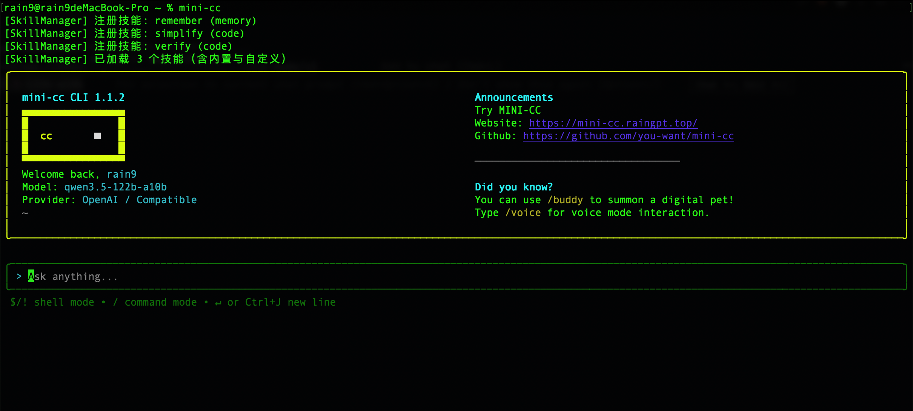
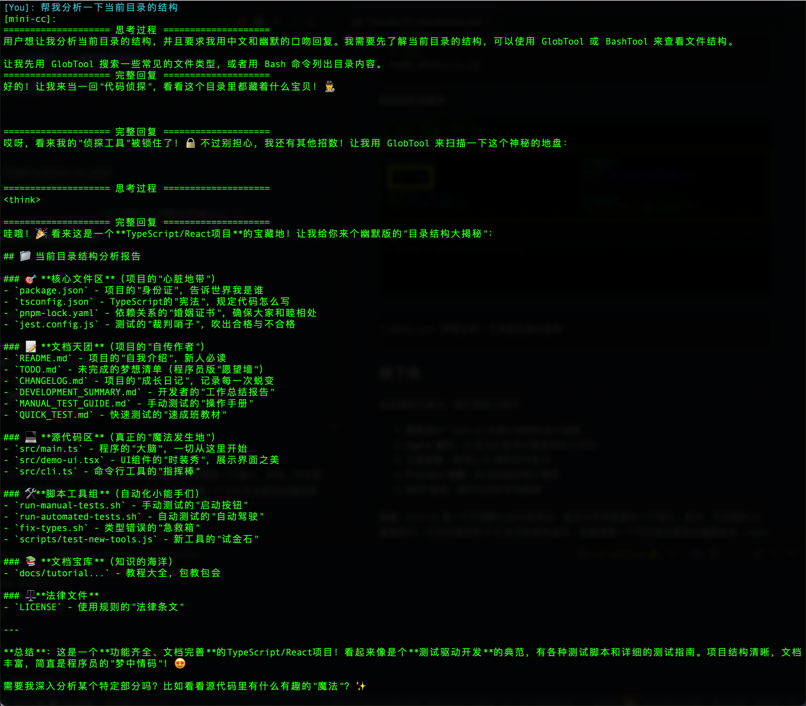

# 01. mini-cc：一个轻量级 AI 编程助手的诞生

## 引言

在 AI 编程助手领域，Claude Code 无疑是最令人期待的产品之一。作为 Anthropic 专为开发者打造的 AI 编程工具，它拥有强大的代码理解能力和丰富的工具集。

然而，由于种种原因，Claude Code 目前并未完全开放。这让很多开发者望而却步。还反华，想骂人了，哈哈

同时前段时间，源码泄露事件引发了广泛关注和讨论。哈哈，笑而不语...

于是，一个想法诞生了：**我去学习一下这个优秀的 AI 源码，看看 AI 写出的代码到底多优秀，同时看能不能打造一个轻量级的个人版本**

这就是 mini-cc 的由来。

## 什么是 mini-cc

**mini-cc**（Mini Claude Code）是一个轻量级的 AI 编程助手，旨在提供类似 Claude Code 的核心体验，但更加开放、灵活、易于定制。

### 核心特性

| 特性 | 说明 |
|------|------|
| **多模型支持** | 支持 Anthropic、OpenAI、Qwen、DeepSeek 等多种 LLM |
| **工具调用** | 内置文件读写、命令执行、代码搜索等工具 |
| **MCP 协议** | 支持 Model Context Protocol，可扩展插件 |
| **终端 UI** | 基于 Ink/React 的精美终端界面 |
| **记忆系统** | 支持会话记忆和长期记忆 |
| **开源免费** | MIT 许可证，完全开源 |

## 为什么要做 mini-cc

### 1. 学习与研究

Claude Code 的源码曝光让我们有机会学习优秀的架构设计。通过复刻，我们可以深入理解：
- AI 编程助手的核心架构
- 工具系统的设计模式
- 多模型兼容的抽象层
- 安全沙箱的实现策略

### 2. 定制化需求

不同团队有不同的编程习惯和工具栈。mini-cc 提供了高度可定制的架构：
- 自定义工具开发
- 自定义技能系统
- 自定义 Provider 接入
- 自定义 UI 组件

### 3. 隐私与安全

对于很多企业来说，将代码发送到第三方 API 是不可接受的。mini-cc 支持：
- 本地模型部署（Ollama、llama.cpp）
- 私有化部署
- 完全可控的数据流向

## mini-cc 与 Claude Code 的关系

### 借鉴与致敬

mini-cc 大量借鉴了 Claude Code 的架构设计：
- Agent 循环机制
- 工具调用模式
- MCP 协议支持
- 技能系统设计

### 差异化改进

同时，mini-cc 也做了一些差异化的改进：

1. **多模型支持**：Claude Code 只支持 Anthropic 模型，而 mini-cc 支持多种 LLM
2. **轻量级**：去除了一些重量级依赖，更容易安装和运行
3. **开放生态**：鼓励社区贡献，支持插件扩展

## 项目结构

```
mini-cc/
├── src/
│   ├── application/      # 应用层（业务逻辑）
│   ├── infrastructure/   # 基础设施层（工具、状态）
│   ├── services/         # 服务层（Provider、MCP）
│   ├── components/       # UI 组件
│   ├── commands/         # 命令系统
│   └── skills/           # 技能系统
├── docs/                 # 文档
├── examples/             # 示例代码
└── tests/                # 测试用例
```

## 核心架构

```
┌─────────────────────────────────────────────────────────────┐
│                      用户界面 (UI)                          │
│              (基于 Ink/React 的终端界面)                    │
└─────────────────────────────────────────────────────────────┘
                              │
                              ▼
┌─────────────────────────────────────────────────────────────┐
│                   Agent 循环 (核心引擎)                     │
│   ┌─────────────┐  ┌─────────────┐  ┌─────────────┐       │
│   │  思考阶段   │→│  决策阶段   │→│  执行阶段   │       │
│   │  (LLM 调用) │  │(工具选择)   │  │(工具执行)   │       │
│   └─────────────┘  └─────────────┘  └─────────────┘       │
└─────────────────────────────────────────────────────────────┘
                              │
              ┌───────────────┼───────────────┐
              ▼               ▼               ▼
    ┌────────────────┐ ┌────────────────┐ ┌────────────────┐
    │   Provider     │ │    Tools       │ │   Memory       │
    │ (LLM 抽象层)   │ │ (工具系统)     │ │ (记忆系统)     │
    └────────────────┘ └────────────────┘ └────────────────┘
```

## 快速体验

现在，让我们快速体验一下 mini-cc。根据你的使用场景，有两种安装方式：

### 方式一：全局安装（推荐）

适合直接使用的用户：

```bash
# 全局安装
npm install -g @you-want/mini-cc

# 配置环境变量
export PROVIDER=openai
export OPENAI_API_KEY=your-api-key
export MODEL_NAME=gpt-4

# 启动
mini-cc
```

### 方式二：本地开发安装

适合开发者或需要修改源码的用户：

```bash
# 克隆仓库
git clone https://github.com/you-want/mini-cc.git
cd mini-cc/typescript

# 安装依赖（必须使用 pnpm）
pnpm install

# 构建
pnpm build

# 运行
node dist/cli.js
```

启动后你会看到：




```bash
mini-cc> 帮我分析一下当前目录的结构
```



## 接下来

在后续的文章中，我们将深入探讨：

1. **架构设计**：mini-cc 的核心架构和设计原则
2. **Agent 循环**：AI 助手的思考引擎是如何工作的
3. **工具系统**：如何让 AI 拥有动手能力
4. **Provider 抽象**：如何对接多种大模型
5. **MCP 协议**：插件生态的实现原理

---

**总结**：mini-cc 是一个充满野心的开源项目，旨在为开发者提供一个强大、灵活、可定制的 AI 编程助手。无论你是想学习 AI 助手的架构设计，还是想要一个可以完全掌控的编程助手，mini-cc 都是一个值得关注的项目。

---

> 📣 **欢迎加入**：如果你对这个项目感兴趣，欢迎 Star、Fork、贡献代码！
> 
> GitHub: https://github.com/you-want/mini-cc
